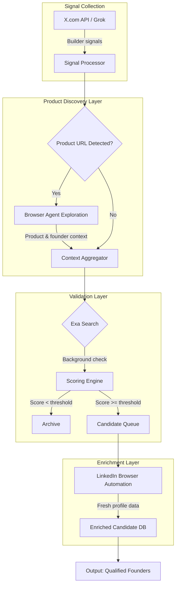
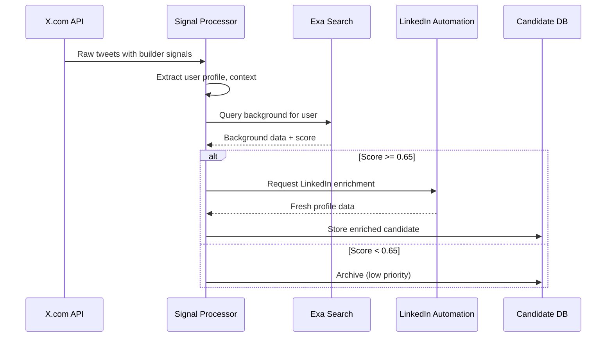

# Design Doc: Founder Discovery Pipeline

**Author:** Engineering Team
**Status:** Draft
**Created:** 2025-01-15

---

## Overview

An automated pipeline to identify high-potential founders by monitoring X.com activity, validating backgrounds via Exa search, and enriching top candidates with fresh LinkedIn data.

## Problem Statement

Finding early-stage founders building interesting things requires:
- Real-time signal detection from social platforms
- Background validation at scale
- Fresh professional data for qualified leads

Manual sourcing doesn't scale. We need an automated funnel.

---

## Architecture



---

## Component Details

### 1. Signal Collection (X.com)

| Approach | Pros | Cons |
|----------|------|------|
| **X API Direct** | Full control, higher rate limits | API costs, maintenance |
| **Grok Integration** | Natural language queries, semantic understanding | Dependency on xAI, less structured |

**Signals we track:**
- "Building in public" posts
- Product launch announcements
- Technical deep-dives
- Hiring/funding discussions

### 2. Product Discovery Layer (Browser Agent)

**Purpose:** When a builder signal includes product URLs (landing pages, Product Hunt, GitHub repos, etc.), we use a browser agent to explore these pages and extract founder-related information before validation.

**URL sources we explore:**
- Product landing pages / marketing sites
- Product Hunt launch pages
- GitHub repository pages (README, contributors)
- App store listings (iOS/Android)
- Indie Hackers profiles
- Personal portfolio sites linked in bio

**Data to extract:**

| Source | Founder Signals |
|--------|-----------------|
| Landing page | "About us", team page, founder bios, contact info |
| Product Hunt | Maker profiles, hunter info, founder comments |
| GitHub | Repository owner, top contributors, organization members |
| App stores | Developer name, company info, support contact |

**Why this helps:**
- Product pages often have direct links to founder LinkedIn/Twitter
- Team pages reveal co-founders we might miss from X signals alone
- "Built by" or "Made by" sections provide verified founder identity
- Product Hunt maker profiles link to founder social accounts
- Improves Exa search accuracy by providing verified founder names

**Browser agent behavior:**
- Navigate to detected product URLs
- Extract structured data from common patterns (team pages, about sections)
- Follow "About", "Team", "Contact" links if present
- Capture founder names, social links, email domains
- Pass enriched context to validation layer

### 3. Validation Layer (Exa Search)

Use Exa to query candidate backgrounds:
- Previous companies founded/worked at
- Technical blog posts or publications
- GitHub activity / open source contributions
- News mentions

**Scoring criteria:**

```
background_score = (
    prior_startup_experience * 0.3 +
    technical_depth * 0.25 +
    domain_expertise * 0.25 +
    network_signal * 0.2
)
```

Threshold: `score >= 0.65` → proceed to enrichment

### 4. Enrichment Layer (LinkedIn Automation)

**Why browser automation?**
- Exa data may be weeks/months stale
- LinkedIn has most current employment status
- Need to verify: "Are they still at BigCo or did they actually leave to build?"

**Data to extract:**
- Current role & company
- "Open to work" / "Hiring" badges
- Recent activity (posts about new venture)
- Connection overlap with our network

---

## Data Flow



---

## API & Rate Limits

| Service | Rate Limit | Notes |
|---------|-----------|-------|
| X API (Basic) | 10K reads/mo | May need Pro tier |
| Grok API | TBD | Currently in beta |
| Exa Search | 1000 req/mo (free) | Scale as needed |
| LinkedIn | N/A (browser) | Respect ToS, add delays |

---

## Risks & Mitigations

| Risk | Impact | Mitigation |
|------|--------|------------|
| X API rate limits | Pipeline stalls | Caching, prioritization |
| LinkedIn anti-bot detection | Account bans | Headless browser + human-like delays |
| Exa data staleness | False negatives | LinkedIn enrichment catches this |
| False positives (noise) | Wasted enrichment | Tune scoring thresholds |

---

## Implementation Phases

- **Phase 1:** X API integration + basic signal detection
- **Phase 2:** Exa background validation + scoring
- **Phase 3:** LinkedIn browser automation for top candidates
- **Phase 4:** Dashboard + alerting for qualified founders

## Open Questions

1. Grok vs X API direct—which provides better signal-to-noise?
2. LinkedIn automation: Playwright vs Puppeteer vs commercial tool?
3. How do we handle multi-founder teams (co-founders)?
4. GDPR/privacy considerations for storing candidate data?
